# Current Architecture

This is the real post-ACP architecture after the source tree cleanup. The
project is organized as Clean Architecture with Ports and Adapters, packaged by
bounded context where that fits the current code.

## Source Layout

```text
src/
  cli.ts                    # compatibility package entrypoint
  apps/
    cli/                    # CLI composition root and CLI-specific commands
    acp/                    # ACP stdio JSON-RPC host
  adapters/
    acp/                    # ACP protocol mapping and client delegation
  application/              # runtime contracts, factory, command/session facades
  core/                     # agent engine and internal subsystems
  ui/
    terminal/
      output/               # print/ANSI renderer and terminal primitives
      interactive/          # OpenTUI/Solid terminal application
      interactive-tui.ts    # interactive TUI facade
      open-tui-assets.ts    # OpenTUI asset setup
  audio/                    # packaged sound assets
  types/                    # project-wide ambient declarations
```

## Runtime Dependency Flow

```mermaid
flowchart TD
  bin["bin/soba.js / dist/cli.js"] --> shim["src/cli.ts"]
  shim --> cli["src/apps/cli/main.ts"]

  cli --> app["src/application<br/>SobaRuntime contracts + factory"]
  cli --> output["src/ui/terminal/output<br/>print renderer"]
  cli --> interactive["src/ui/terminal/interactive<br/>OpenTUI app"]
  cli --> acpHost["src/apps/acp/server.ts<br/>stdio JSON-RPC host"]

  acpHost --> acpAdapter["src/adapters/acp<br/>ACP dispatcher, schemas, delegation"]
  acpAdapter --> app

  interactive --> app
  interactive --> coreTypes["src/core<br/>types, provider/trust/session collaborators"]
  output --> coreEvents["src/core<br/>event/i18n types"]

  app --> core["src/core<br/>agent loop, controllers, tools, sessions, providers, MCP, memory"]

  core --> provider["provider/client"]
  core --> mcp["MCP clients/transports/secrets"]
  core --> tools["local + memory tools"]
  core --> loop["loop/controllers/verification/permissions"]
  core --> state["sessions/skills/memory/compaction/trust"]
```



## Boundaries Enforced Today

- `src/core` does not import `src/apps`, `src/application`, `src/adapters`, or `src/ui`.
- `src/application` does not import `src/apps`, `src/adapters`, or `src/ui`.
- `src/adapters/acp` depends on `src/application` contracts, not on `src/core`.
- `src/apps/acp` hosts transport and dispatch only; it does not reach into `src/core`.
- `src/ui` is allowed to use runtime contracts and selected core collaborators, but it must not depend on app entrypoints or ACP code.

## Current Compromises

- `src/core` is still broader than a pure domain layer. It contains the engine,
  provider client code, MCP transports, local tools, config-facing subsystems,
  and session persistence.
- `src/application/runtime-factory.ts` is still the main composition surface. It
  creates concrete core services directly, so it is a facade plus composition
  root, not only pure use-case orchestration.
- Terminal UI still imports selected core collaborators directly for provider,
  trust, config, session, and event types. That is acceptable for this step, but
  the cleaner long-term direction is to narrow those through application ports.
- `src/cli.ts` remains as a tiny compatibility shim so existing package build,
  project setup tests, and `bun run src/cli.ts` workflows continue to work.

## Good Next Refactors

1. Split `src/core` into `engine` and `infrastructure` once ports are ready:
   provider clients, MCP transports, config loading, and filesystem-facing tools
   are the main candidates.
2. Move CLI slash-command execution behind an application command port. Today
   `src/apps/cli/commands.ts` still knows many core services directly.
3. Narrow TUI dependencies on core by exposing provider, trust, and session
   operations through `SobaRuntime` or smaller application services.
4. Make `runtime-factory` thinner by extracting provider/MCP/tool composition
   into dedicated infrastructure factories.
