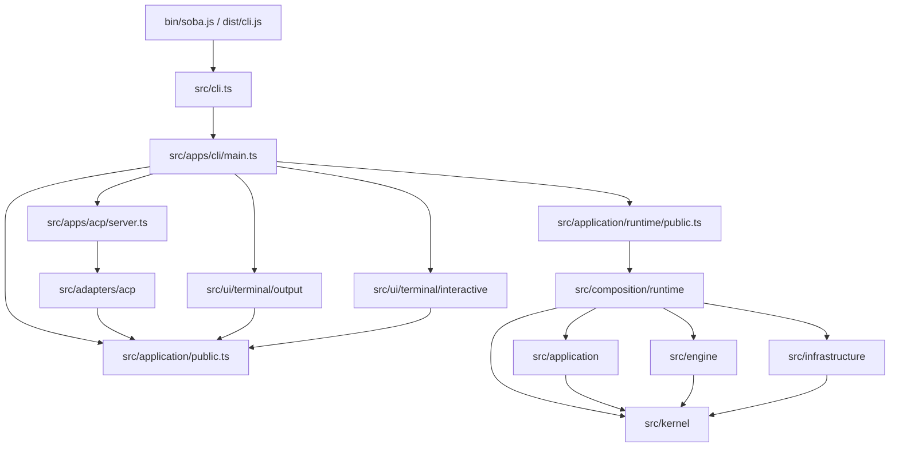

# Current Architecture

The project uses layered ports-and-adapters boundaries. The retired `src/core`
namespace is intentionally absent; new code must enter one explicit owner layer.

## Source Layout

```text
src/
  cli.ts                    # compatibility package entrypoint
  apps/
    cli/                    # CLI host
    acp/                    # ACP stdio JSON-RPC host
  adapters/
    acp/                    # ACP protocol mapping and client delegation
  application/              # public runtime/use-case APIs and command/session facades
  composition/              # concrete dependency wiring
  engine/                   # agent turn orchestration, compaction, verification, prompt logic
  infrastructure/           # provider, MCP, tools, persistence, terminal integrations
  kernel/                   # pure contracts, transcript/model/tool/session ports
  shared/                   # shared non-domain support such as i18n
  ui/
    terminal/
      output/               # print/ANSI renderer and terminal primitives
      interactive/          # OpenTUI/Solid terminal application
  audio/                    # packaged sound assets
  types/                    # project-wide ambient declarations
```

## Runtime Dependency Flow



## Enforced Boundaries

- `src/core` must not exist.
- `src/kernel` does not import application, engine, infrastructure, apps,
  adapters, UI, `node:`, `bun:`, or OpenTUI.
- `src/engine` does not import infrastructure, apps, adapters, or UI.
- `src/application` does not import apps, adapters, UI, or OpenTUI.
- `src/infrastructure` does not import apps or UI.
- `src/apps` and `src/ui` use public application API modules instead of
  reaching into kernel, engine, or infrastructure internals.
- `src/composition` is the only layer allowed to assemble concrete
  application, engine, infrastructure, and kernel implementations.

The executable gate is:

```bash
bun run check:boundaries
```

## Current Compromises

- `src/application/public.ts` is still a broad migration facade. It keeps
  delivery layers off internals, but should be narrowed into focused public
  APIs as command/session/provider/skill/MCP services mature.
- `src/engine/turn/agent-loop.ts` is still a large legacy orchestrator. The
  workflow controllers around model turns, tools, permissions, context,
  completion, and verification have been extracted, but the turn pipeline still
  needs to be split further.
- Some tests still live under `tests/core/**` for historical continuity. Those
  test locations do not imply a production `src/core` namespace.

## Next Refactors

1. Replace the broad `application/public.ts` facade with focused public modules.
2. Move CLI slash-command implementations into `src/application/commands`.
3. Continue splitting `engine/turn/agent-loop.ts` into prompt, tool-call,
   verification, evidence, completion, and turn-result coordinators.
