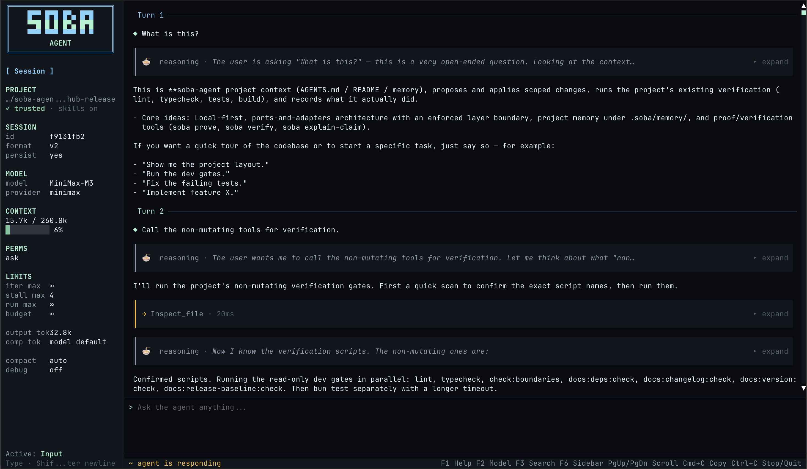

<h1 align="center">SOBA Agent</h1>

<p align="center">
  <strong>Local-first engineering agent for code changes with a verifiable trail.</strong>
</p>

<p align="center">
  <a href="https://www.npmjs.com/package/soba-agent"></a>
  <a href="https://github.com/avacadorun-dev/soba-agent/releases"></a>
  <a href="https://github.com/avacadorun-dev/soba-agent/actions/workflows/ci.yml"></a>
  <a href="./LICENSE"></a>
</p>

<p align="center">
  <a href="#install">Install</a>
  · <a href="#first-workflow">First workflow</a>
  · <a href="https://soba-agent.dev/en/docs/quick-start">Docs</a>
  · <a href="https://soba-agent.dev/en/docs/changelog">Changelog</a>
</p>

SOBA runs in your terminal, keeps project context close to the repository, works through bounded tool loops, and writes
receipts for the work it claims to have done. It is built for everyday engineering tasks where the important question is
not only "did the agent edit the code?", but also "what changed, what was checked, what permissions were used, and what
evidence supports the handoff?"

<p align="center">
  
</p>

SOBA is built for engineers who want an agent to stay close to the repo: inspect before editing, ask for permission
before risky operations, run the project's own checks, and leave behind receipts that can be reviewed after the session.

## What SOBA is for

SOBA is a coding agent with a local workflow:

- **Interactive TUI** for agent sessions, shell commands, slash commands, permissions, context, and model state.
- **Sealed Proof Bundle v1 receipts** in `.soba/evidence/*.soba-proof.json`, with stable run/proof IDs, recursive
  redaction, and whole-receipt SHA-256 integrity.
- **Proof claim mapping** through `soba verify` and `soba explain-claim`, making unsupported claims visible instead of
  hiding them in prose.
- **Run metrics in sealed receipts** for model calls and input/output/total tokens, so eval consumers do not have to
  infer usage from terminal output.
- **Project Memory** in `.soba/memory/` with source receipts, stale checks, doctor output, and explanations.
- **Bounded permissions** for dangerous operations, with permission receipts recorded in proof output.
- **MCP support** for local `stdio` servers and remote `streamableHttp` endpoints.
- **Skills** for reusable project workflows, plus eval, bench, and trace commands for improving them over time.
- **Portable capsules** for compacting, resuming, and handing off long sessions.

The current `0.6.x` line is focused on proof integrity, adversarial false-completion tests, and a real-model evaluation
baseline. A pinned ordinary-agent versus SOBA comparison now covers three task classes and two repetitions with external
acceptance outside producer workspaces, declared change scope, and six independently verified SOBA receipts. `0.7.0`
targets a portable proof API, external run manifests,
and a generic CI gate; safe workspaces come
before any larger delegation loop.

## Install

With npm:

```bash
npm install -g soba-agent
```

The npm package includes a pinned Bun runtime dependency, so users do not need to install Bun separately before running
`soba`.

With Bun:

```bash
bun add -g soba-agent
```

Use the Bun install path when Bun is already part of your toolchain and you want Bun to manage the global package.

Check the CLI:

```bash
soba --version
soba --help
soba init --check
```

Start the interactive terminal UI:

```bash
soba -i
```

## First workflow

1. Check providers:

   ```bash
   soba provider list
   ```

2. Run a minimal one-shot provider check:

   ```bash
   soba --no-session --max-agent-iterations 1 "Answer with one word: ok"
   ```

3. Open the TUI:

   ```bash
   soba -i --lang en --theme graphite
   ```

4. In the TUI, start with a bounded task:

   ```text
   Inspect this project.
   Read package.json and the test layout first.
   Then propose a short plan.
   If edits are needed, keep them inside the plan and run a targeted test.
   Do not create a git commit.
   ```

5. Run local checks from the TUI when you want direct control:

   ```text
   !git status --short
   !git diff --stat
   !bun test
   ```

6. Inspect the proof trail after non-trivial work:

   ```bash
   soba prove --last
   soba verify --last
   soba explain-claim "No test regressions detected"
   ```

If a claim is not backed by evidence, SOBA should keep that visible. The receipt is the handoff artifact, not just a
transcript summary.

New receipts are sealed before persistence. `soba verify` returns exit `0` only for an accepted `verified` proof;
invalid, partially verified, unverified, and blocked outcomes return stable non-zero exit codes and machine-readable
reasons. Legacy receipts without integrity metadata remain readable with a warning but are not tamper-evident.

### Custom provider message compatibility

Wire compatibility is configured per model, so one OpenAI-compatible endpoint
can expose models with different chat-template requirements. Models whose chat
template accepts at most one leading system message can opt in explicitly:

```json
{
  "id": "strict-chat-provider",
  "name": "Strict Chat Provider",
  "baseUrl": "https://example.test/v1",
  "apiKeyEnv": "STRICT_CHAT_API_KEY",
  "adapter": "openai",
  "defaultModel": "strict-model",
  "models": [
    {
      "id": "strict-model",
      "name": "Strict Model",
      "contextWindow": 131072,
      "maxOutput": 8192,
      "supportsStreaming": true,
      "supportsThinking": true,
      "compatibility": ["single_system_message"]
    }
  ]
}
```

With `single_system_message`, SOBA merges core instructions, active skill
instructions, context capsules, and compaction summaries into one system
message at index zero. The flag is never inferred from provider or model names.
Providers without it retain their original wire format. Load a complete custom
provider definition with `soba provider add <id> --from-file <path>`.

## Work modes

Use `/plan agent`, `/plan plan`, or `/plan goal` to choose whether SOBA should implement, prepare a decision-complete
plan, or clarify the objective and success criteria. In Plan and Goal modes, mutation tools and `bash`/`local_shell`
are removed from the model's tool schemas before inference while the runtime denial remains as a second safety layer.
Implementation-style prompts in Plan Mode are automatically treated as requests to inspect and plan, without asking
the user to switch modes. See the [Plan and goal modes guide](https://soba-agent.dev/en/docs/plan-mode).

## Project Memory

Project Memory stores durable project facts under `.soba/memory/` so future sessions can reuse context without relying
only on a long chat transcript.

Ask SOBA to save facts with source receipts:

```text
Update Project Memory:
- architecture: core modules and data flow;
- conventions: Bun only, strict TypeScript, tests with bun test;
- known-errors: recurring failures and verification commands;
- dependencies: important runtime and dev dependencies.

Use project memory tools. Include source.file, source.lines, source.lastVerified, source.confidence, and staleIfFilesChange when a source can be verified.
Do not store secrets.
```

Then inspect memory health:

```bash
soba memory doctor
soba memory stale
soba memory verify
soba memory explain "provider registry"
```

## Skills

Skills are reusable workflows that live with the project or the user environment. In the TUI:

```text
/skill list
/skill:commit-message Suggest a conventional commit message for staged changes.
/skill deactivate commit-message
```

Activated skills are session-scoped, restored on session resume, and can be deactivated explicitly when they no longer apply. Bundled skills are included in both package and standalone binary distributions.

Project skills require trust:

```text
/project-trust status
/project-trust approve
```

For skills that should stay reliable, use the eval loop:

```text
/skill eval <name>
/skill bench <name>
/skill trace <name>
```

## MCP tools

MCP servers are configured in `.soba/mcp.json`. From the TUI:

```text
/mcp status
/mcp start <server>
/mcp reload
/mcp status
```

SOBA supports local `stdio` servers and remote `streamableHttp` endpoints. Remote credentials should come from
environment-backed auth such as `bearerEnv` or `apiKeyEnv`.

## Session controls

Common ways to continue work:

```bash
soba -i
soba -c -i
soba -r
soba -s <SESSION_ID> "Continue the task"
```

Useful TUI commands:

```text
/session
/sessions list
/budget
/permissions ask
/permissions repo
/auto-compact on
/compact Preserve the goal, decisions, changed files, checks, risks, and next step.
/capsule
/rewind
```

Auto-compaction is a deferred preflight barrier: turn and milestone triggers mark
work as pending, then SOBA shows live progress and waits immediately before the
next model call. The TUI remains responsive and queues new input. Disabling
`/auto-compact` affects soft triggers only; hard-limit and overflow recovery stay enabled.

## From source

```bash
git clone git@github.com:avacadorun-dev/soba-agent.git
cd soba-agent
bun install
bun run build
bun run src/cli.ts --help
```

Development gates:

```bash
bun run lint
bun run typecheck
bun test
bun run build
```

SOBA uses Biome for linting/formatting and Bun for scripts, tests, and builds.

## Standalone binaries

Tagged GitHub releases build standalone binaries for macOS and Linux. Download the matching `soba-*` asset from the
release, make it executable, and run it directly:

```bash
VERSION="$(node -p "require('./package.json').version")"
chmod +x "./soba-linux-x64-v${VERSION}"
"./soba-linux-x64-v${VERSION}" --version
```

For normal use, prefer the npm or Bun global install path. Use a standalone binary when you do not want a global package
manager install.

## Documentation

- [Quick Start](https://soba-agent.dev/en/docs/quick-start)
- [Project walkthrough](https://soba-agent.dev/en/docs/walkthrough-building-a-project)
- [Proof receipts](https://soba-agent.dev/en/docs/proof)
- [Project Memory](https://soba-agent.dev/en/docs/project-memory)
- [Skills](https://soba-agent.dev/en/docs/skills)
- [CLI reference](https://soba-agent.dev/en/docs/cli-reference)
- [Changelog](https://soba-agent.dev/en/docs/changelog)

The documentation site source lives in `docs-site/`.

## License

MIT © 2026 avacado.run <avacado.run@gmail.com>
