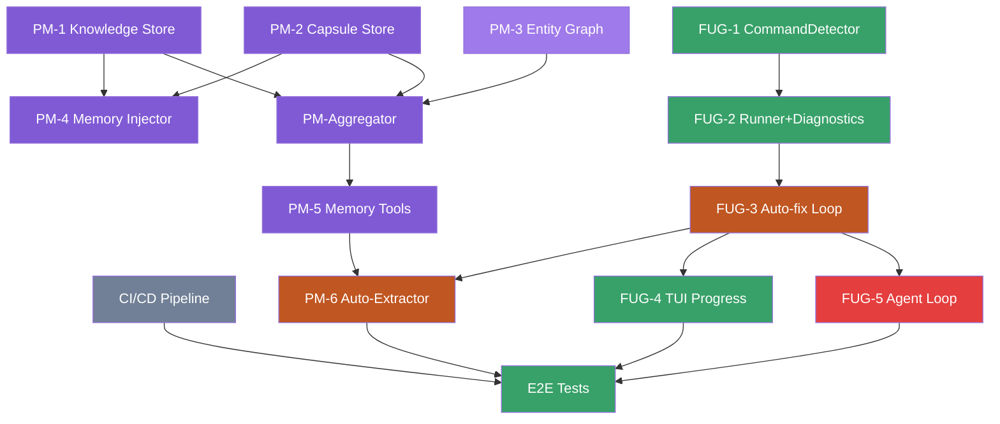

# Phase 3 — План реализации (v4 — без TUI)

**Всего задач:** 15 (5 + 3 + 2 + 4 + 1)
**Оценка:** 7-10 дней

> **Ключевое изменение:** TUI/UX задачи (10 шт) вынесены в **Phase 2.5** (`docs/phase-2.5-tui-ux/`).
> Phase 3 теперь фокусируется на Project Memory + Fix-Until-Green + CI/CD.

---

## Правила (нарушение = переписывание)

1. **Agent Loop модифицируется ровно один раз** — в D3 (Fix-Until-Green Agent Loop Integration).
   Ни одна задача до этого не трогает `agent-loop.ts`.
2. **System Prompt — однократная модификация** для memory (B1: Memory Injector).
   Fix-инструкции (D3) добавляются в другую секцию.
3. **Tools Registry — однократная регистрация.** Memory tools (C2) и fix tools (D3)
   имеют разные имена, не пересекаются.

---

## ФАЗА A: Foundation (5 параллельных задач)

> Ни от кого не зависят. Можно делать в любом порядке.

### A1: PM-1. Knowledge Store

**Приоритет:** 🔴 P0 | **Оценка:** 2-3 часа

**Файлы:**
- `src/core/memory/types.ts` — типы
- `src/core/memory/knowledge-store.ts` — CRUD для .soba/memory/knowledge/*.md
- `tests/memory/knowledge-store.test.ts`

**Что сделать:**
1. KnowledgeStore: init, loadAll, read, write, append, reset, exists
2. 4 файла: architecture.md, conventions.md, known-errors.md, dependencies.md
3. Default шаблоны при первом создании
4. estimateTotalTokens, formatForPrompt
5. Тесты: create, read, update, append, reset, несуществующий, estimate

---

### A2: PM-2. Capsule Store

**Приоритет:** 🔴 P0 | **Оценка:** 3-4 часа

**Файлы:**
- `src/core/memory/capsule-store.ts` — capsules/*.json + index.json
- `tests/memory/capsule-store.test.ts`

**Что сделать:**
1. CapsuleStore: add, get, list (with filters), prune, getRelevant
2. index.json: version, lastUpdated, capsuleCount, capsules[]
3. Pruning: max 50, critical never prune, low >30d удаляются
4. Relevance: tags match + recency + priority
5. Тесты: add, get, list, filter by type, prune, relevance scoring

---

### A3: PM-3. Entity Graph

**Приоритет:** 🟡 P1 | **Оценка:** 2-3 часа

**Файлы:**
- `src/core/memory/entity-graph.ts` — graph.json CRUD
- `tests/memory/entity-graph.test.ts`

**Что сделать:**
1. EntityGraph: addNode, addEdge, getNode, getNeighbors, save, load
2. Nodes: id, type (file/function/class/module/error/dependency), name, metadata
3. Edges: from, to, type (depends_on/contains/fixes/related_to/imports)
4. Тесты: add node, add edge, get neighbors, save/load, empty graph

---

### A4: FUG-1. CommandDetector

**Приоритет:** 🔴 P0 | **Оценка:** 2-3 часа

**Файлы:**
- `src/core/fix-until-green/detector.ts`
- `src/core/fix-until-green/types.ts`
- `tests/core/fix-until-green/detector.test.ts`

**Что сделать:**
1. ProjectCommandsDetector: package.json → Cargo.toml → pyproject.toml → Go.mod → Makefile
2. Определяет: test, lint, build команды
3. Кэширует результат (не сканирует каждый раз)
4. Fallback: bun test → npm test → npx vitest run → make test
5. Тесты: package.json, без тестов, монорепа, Makefile

---

### A5: CI/CD Pipeline

**Приоритет:** 🟡 P1 | **Оценка:** 2-3 часа

**Файлы:**
- `.github/workflows/ci.yml`
- `.github/workflows/release.yml`
- `.github/PULL_REQUEST_TEMPLATE.md`
- `.github/ISSUE_TEMPLATE/bug_report.md`
- `.github/ISSUE_TEMPLATE/feature_request.md`
- `.hooks/pre-commit`
- `CONTRIBUTING.md`
- `CHANGELOG.md`

**Что сделать:**
1. CI: lint → test → build на push/PR
2. Pre-commit hook: biome check --write + tsc + bun test (changed)
3. PR template, issue templates
4. CONTRIBUTING.md + CHANGELOG.md (keep a changelog format)

---

## ФАЗА B: Aggregation (3 задачи)

> Собирают Фазу A. Частичная последовательность.

### B1: PM-4. Memory Injector

**Приоритет:** 🔴 P0 | **Оценка:** 2-3 часа
**Зависит от:** A1, A2
**⚠️ Модифицирует:** `src/core/prompt/system-prompt.ts`

**Файлы:**
- `src/core/memory/memory-injector.ts` — новая функция
- `src/core/prompt/system-prompt.ts` — вызов injector
- `tests/memory/memory-injector.test.ts`

**Что сделать:**
1. buildProjectMemorySection(memory: ProjectMemory): string
2. Формирует `<project_knowledge>` + `<project_memory>` секции
3. Вызывается из buildSystemPrompt
4. Тесты: полный memory → форматированная секция, пустая память → пустая строка, total tokens < budget

---

### B2: PM-Aggregator. ProjectMemory class

**Приоритет:** 🔴 P0 | **Оценка:** 3-4 часа
**Зависит от:** A1, A2, A3

**Файлы:**
- `src/core/memory/project-memory.ts`
- `tests/memory/project-memory.test.ts`

**Что сделать:**
1. ProjectMemory class: load, save, getKnowledgeFiles, getRelevantCapsules, addCapsule, getGraph
2. Инициализация всех трёх слоёв
3. save → вся persistence
4. Тесты: полная интеграция (init → add → save → load → read)

---

### B3: FUG-2. Runner + Diagnostics

**Приоритет:** 🔴 P0 | **Оценка:** 3-4 часа
**Зависит от:** A4

**Файлы:**
- `src/core/fix-until-green/runner.ts`
- `src/core/fix-until-green/diagnostics.ts`
- `tests/core/fix-until-green/runner.test.ts`
- `tests/core/fix-until-green/diagnostics.test.ts`

**Что сделать:**
1. CommandRunner: запуск команды, сбор stdout/stderr, exit code, duration
2. ErrorDiagnostics: парсинг TS ошибок, test failures, lint errors, runtime errors
3. Расширяемый ErrorParserRegistry
4. Тесты: TS ошибка, тест-фейл, runtime, пустой вывод

---

## ФАЗА C: Loop & Tools (2 задачи)

### C1: FUG-3. Auto-fix Loop

**Приоритет:** 🔴 P0 | **Оценка:** 4-6 часов
**Зависит от:** B3

**Файлы:**
- `src/core/fix-until-green/loop.ts`
- `tests/core/fix-until-green/loop.test.ts`

**Что сделать:**
1. FixUntilGreenLoop: generate → run → detect → fix → repeat (max 3)
2. Эмиттит события: fix_attempt, fix_progress, fix_success, fix_failure
3. Budget-aware (стоп при превышении лимита токенов)
4. Partial progress: если ошибок стало меньше — доп итерация
5. Тесты: исправление TS ошибки, исправление теста, невозможная ошибка

---

### C2: PM-5. Memory Tools

**Приоритет:** 🔴 P0 | **Оценка:** 2-3 часа
**Зависит от:** B2

**Файлы:**
- `src/core/memory/memory-tools.ts`
- `tests/memory/memory-tools.test.ts`

**Что сделать:**
1. `read_project_memory` tool: агент запрашивает память (по тегам, типу, дате)
2. `write_project_memory` tool: агент записывает капсулу
3. Регистрация в Tools Registry
4. Тесты: read memory, write memory, read с фильтрами

---

## ФАЗА D: Integration (4 задачи)

> Соединяет всё. Самая рискованная фаза.

### D1: PM-6. Auto-Extractor

**Приоритет:** 🟡 P1 | **Оценка:** 2-3 часа
**Зависит от:** C1, C2

**Файлы:**
- `src/core/memory/extractor.ts`
- `tests/memory/extractor.test.ts`

**Что сделать:**
1. ExtractMemoryCapsule из ошибки + фикса
2. Интеграция с FixUntilGreenLoop (afterEach / afterAll)
3. Сохраняет: error type, cause, fix, file, summary
4. Тесты: экстракция из TS ошибки, экстракция из test failure

---

### D2: FUG-4. TUI Progress Fix-Until-Green

**Приоритет:** 🔴 P0 | **Оценка:** 3-4 часа
**Зависит от:** C1

**Файлы:**
- `src/widgets/tui/ui/fix-progress.tsx`
- `src/widgets/tui/model/fix-store.ts`
- `tests/widgets/fix-progress.test.ts`

**Что сделать:**
1. FixProgress: overlay с прогрессом fix-цикла
2. Показывает: попытка (1/3), ошибка, план фикса, результат
3. События из FixUntilGreenLoop
4. Тесты: render, progress update, success, failure

---

### D3: FUG-5. Agent Loop Integration

**Приоритет:** 🔴 P0 | **Оценка:** 2-3 часа
**Зависит от:** C1
**⚠️ ЕДИНСТВЕННАЯ модификация agent-loop.ts в Phase 3**

**Файлы:**
- `src/core/loop/agent-loop.ts` — модификация
- `src/core/loop/types.ts` — новые типы
- `src/widgets/tui/commands/fix-command.ts` — /fix on/off

**Что сделать:**
1. После tool-result (write/edit/bash), если команда выполнена → проверить, запустить Fix-Until-Green
2. Правило: если юзер запросил «почини»/«сделай чтобы работало» → запускаем
3. AgentEvent: fix_until_green_start, fix_attempt, fix_progress, fix_success, fix_failure
4. Флаг fixUntilGreen: boolean (default: true)
5. /fix on /fix off
6. Системный промпт: инструкция агенту использовать Fix-Until-Green

---

## ФАЗА E: Polish & Verify (1 задача)

### E1: E2E Integration Tests + Final Verification

**Приоритет:** 🟡 P1 | **Оценка:** 2-3 часа
**Зависит от:** D1, D2, D3, A5

**Что сделать:**

1. **Финальный прогон (обязательно):**
   - `bun test` — все тесты зелёные
   - `biome check .` — 0 ошибок
   - `bun run build` — проходит

2. **Интеграционные тесты (создать новые):**
   - `tests/e2e/memory-lifecycle.test.ts` — инициализация → запись знания → инжекция в prompt
   - `tests/e2e/fix-integration.test.ts` — команда → фейл → FUG чинит → тесты зелёные
   - `tests/e2e/memory-fix-integration.test.ts` — FUG чинит → Auto-Extractor сохраняет капсулу → памяти становится больше
   - `tests/e2e/slash-registry-fallback.test.ts` — slash-команда из Phase 2.5 registry отрабатывает

3. **Проверка критериев завершения Phase 3:**
   - Пройти по всем критериям из секции «Критерии завершения»
   - Заполнить чек-лист в `docs/phase-3-core/readiness-review.md`

---

## Dependency Graph

---

## Критерии завершения Phase 3

### Project Memory
1. ✅ `.soba/memory/knowledge/*.md` создаются и читаются
2. ✅ `.soba/memory/capsules/*.json` управляются с pruning
3. ✅ `.soba/memory/graph.json` сохраняется
4. ✅ Память инжектится в system prompt
5. ✅ Агент через tools читает/пишет память
6. ✅ Auto-Extractor создаёт капсулы из Fix-Until-Green

### Fix-Until-Green (KILLER FEATURE)
7. ✅ Детектор определяет test/lint/build
8. ✅ Runner собирает структурированную диагностику
9. ✅ Auto-fix loop: generate → run → detect → fix → repeat (max 3)
10. ✅ TUI показывает прогресс
11. ✅ Интегрирован в Agent Loop

### Pipeline
12. ✅ CI workflow на push/PR
13. ✅ Pre-commit hook
14. ✅ CONTRIBUTING.md

### Quality Gates
15. ✅ Все тесты зелёные
16. ✅ biome check → 0 errors
17. ✅ bun run build проходит
