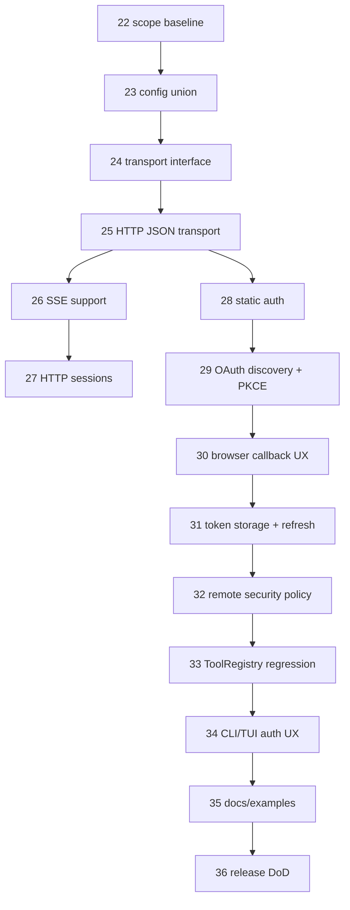

# v0.4.0 — Remote MCP Streamable HTTP + OAuth plan

Date: 2026-06-20

## Decision

Remote MCP over Streamable HTTP with OAuth and production UX is now part of the v0.4.0 release scope.

Existing tasks 01–21 remain the stdio MCP and Project Memory foundation. Remote transport work is added as tasks 22–36 so
the original foundation stays reviewable and the release boundary change is explicit.

## Specification baseline

- Released compatibility baseline: MCP `2025-11-25`.
- Architecture target: draft/next-compatible internals where this does not block released compatibility.
- Required remote transport: Streamable HTTP.
- Deprecated HTTP+SSE transport from `2024-11-05`: not implemented as a first-class transport unless a separate legacy
  compatibility decision is made.
- Authorization baseline: MCP authorization for HTTP-based transports, OAuth 2.1 authorization code with PKCE, OAuth 2.0
  Protected Resource Metadata, authorization server metadata, OpenID Connect discovery fallback, optional Dynamic Client
  Registration where supported.

## Scope added to v0.4.0

SOBA must support MCP servers configured as direct remote HTTP endpoints:

```json
{
  "version": 1,
  "servers": {
    "context7": {
      "transport": "streamableHttp",
      "url": "https://example.com/mcp",
      "auth": {
        "type": "oauth"
      },
      "trustMode": "normal"
    }
  }
}
```

The implementation must keep stdio unchanged and add HTTP as a second transport behind the same MCP lifecycle, manager,
tool proxy, trust, and AgentLoop paths.

## Non-goals

- SOBA-as-MCP-server.
- MCP marketplace/catalog.
- Generic browser automation beyond opening the authorization URL and receiving a local callback.
- Server-provided instructions overriding SOBA system prompt, trust policy, or user intent.
- Security decisions derived from MCP tool annotations, server descriptions, or remote metadata.
- First-class support for deprecated HTTP+SSE unless a real target server forces that compatibility task.

## Task sequence

| № | ID | File | Purpose |
|---|----|------|---------|
| 22 | 0.4-MCP-13 | [`tasks/22-mcp-remote-scope-protocol-baseline.md`](tasks/22-mcp-remote-scope-protocol-baseline.md) | Lock remote MCP protocol, security, and UX scope. |
| 23 | 0.4-MCP-14 | [`tasks/23-mcp-config-transport-union.md`](tasks/23-mcp-config-transport-union.md) | Extend config schema with stdio/Streamable HTTP transport union. |
| 24 | 0.4-MCP-15 | [`tasks/24-mcp-transport-interface-hardening.md`](tasks/24-mcp-transport-interface-hardening.md) | Make MCP transport abstraction protocol-neutral and cancellation-safe. |
| 25 | 0.4-MCP-16 | [`tasks/25-mcp-streamable-http-json-transport.md`](tasks/25-mcp-streamable-http-json-transport.md) | Implement Streamable HTTP POST with JSON responses. |
| 26 | 0.4-MCP-17 | [`tasks/26-mcp-streamable-http-sse-support.md`](tasks/26-mcp-streamable-http-sse-support.md) | Add SSE response/listen support for Streamable HTTP. |
| 27 | 0.4-MCP-18 | [`tasks/27-mcp-http-session-management.md`](tasks/27-mcp-http-session-management.md) | Handle `MCP-Session-Id`, session restart, and DELETE cleanup. |
| 28 | 0.4-MCP-19 | [`tasks/28-mcp-http-static-auth.md`](tasks/28-mcp-http-static-auth.md) | Support static bearer/API-key headers without leaking secrets. |
| 29 | 0.4-MCP-20 | [`tasks/29-mcp-oauth-discovery-pkce.md`](tasks/29-mcp-oauth-discovery-pkce.md) | Implement OAuth discovery, scope selection, and PKCE primitives. |
| 30 | 0.4-MCP-21 | [`tasks/30-mcp-oauth-browser-callback-ux.md`](tasks/30-mcp-oauth-browser-callback-ux.md) | Add browser login flow and local callback UX. |
| 31 | 0.4-MCP-22 | [`tasks/31-mcp-oauth-token-storage-refresh.md`](tasks/31-mcp-oauth-token-storage-refresh.md) | Persist, refresh, redact, and revoke OAuth tokens. |
| 32 | 0.4-MCP-23 | [`tasks/32-mcp-remote-security-trust-policy.md`](tasks/32-mcp-remote-security-trust-policy.md) | Add remote-specific trust, origin, and URL policy. |
| 33 | 0.4-MCP-24 | [`tasks/33-mcp-remote-tool-registry-regression.md`](tasks/33-mcp-remote-tool-registry-regression.md) | Prove remote tools use the same ToolRegistry and AgentLoop path. |
| 34 | 0.4-MCP-25 | [`tasks/34-mcp-cli-tui-remote-auth-ux.md`](tasks/34-mcp-cli-tui-remote-auth-ux.md) | Add `/mcp auth` commands and TUI remote auth states. |
| 35 | 0.4-MCP-26 | [`tasks/35-mcp-remote-docs-examples.md`](tasks/35-mcp-remote-docs-examples.md) | Document remote MCP config, OAuth flow, and examples. |
| 36 | 0.4-REL-36 | [`tasks/36-remote-mcp-release-dod.md`](tasks/36-remote-mcp-release-dod.md) | Final regression and release DoD for remote MCP. |

## Critical path



## Quality gates

Every implementation task must add or update tests and run the targeted verification listed in its task card.

Before merging the remote MCP block, run the full gate:

```bash
bun test
bun run lint
bunx tsc --noEmit
bun run build
bun run .soba/skills/ts-morph-analyzer/scripts/dead-code.ts
```

Docs-site gates are required if `docs-site/` changes:

```bash
cd docs-site && bun run check
```

## Manual acceptance scenarios

1. A stdio MCP server still starts and exposes tools after the transport union lands.
2. A remote Streamable HTTP MCP server without auth can initialize, list tools, and call a tool.
3. A remote Streamable HTTP MCP server returning `text/event-stream` can return the final JSON-RPC response over SSE.
4. A server that returns `MCP-Session-Id` gets that header on subsequent requests.
5. A server that expires the session with HTTP 404 triggers a controlled re-initialization.
6. A server requiring bearer auth can use `${ENV:TOKEN}` without leaking the value.
7. A protected OAuth server triggers login, opens the browser, receives the local callback, stores tokens, and retries.
8. Expired access token refreshes without a second browser login.
9. Revoked/invalid refresh token degrades to `auth_required` and gives a clear next action.
10. `/mcp status` shows remote auth state without showing secrets.
11. `/mcp auth login <id>` and `/mcp auth logout <id>` work.
12. Remote tools appear as OpenAI-safe names and go through the same trust prompt and ToolRegistry path as stdio tools.
13. Remote server descriptions, annotations, and instructions do not alter trust decisions.
14. Network failure, 401, 403, 404 session expiry, 429, timeout, malformed SSE, and invalid JSON produce typed errors.
15. Final docs contain no examples that require unsupported HTTP+SSE or marketplace behavior.
