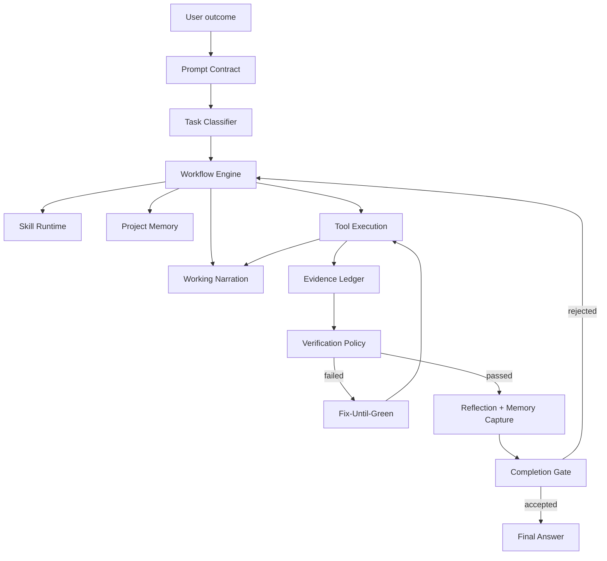

# Design

## Problem Statement

SOBA должна принимать короткий prompt пользователя и сама выполнять задачу как профессиональный инженер. Пользователь не
должен писать: "прочитай инструкции, составь план, проверь тестами, если упало — почини". Это обязанность Agent Loop.

Слабые модели не удерживают такой процесс стабильно в голове. Поэтому процесс должен быть внешним runtime-каркасом.

## Target Behavior

Пользователь пишет:

```text
Почини падение тестов
```

SOBA сама:

1. классифицирует задачу как bug/test failure;
2. читает проектные инструкции и релевантную память;
3. коротко сообщает пользователю, какой контекст собирает и почему;
4. строит короткий work plan;
5. выбирает skill;
6. локализует проблему;
7. вносит минимальный patch;
8. запускает project verification;
9. если verification падает, входит в Fix-Until-Green;
10. сохраняет устойчивый lesson в memory;
11. завершает только с evidence.

## Architecture Overview



## Components

### Prompt Contract

`SYSTEM.md` и runtime prompt должны описывать один и тот же обязательный цикл:

```text
understand -> inspect -> plan -> act -> verify -> reflect -> finish
```

Prompt не должен быть огромным. Его задача — назвать правила, роли tools, stop conditions и forbidden shortcuts.
Подробные playbooks живут в skills.

### Task Classifier

Лёгкий runtime-компонент, который определяет тип задачи:

- `read_only_question`;
- `code_change`;
- `bug_fix`;
- `test_failure`;
- `lint_failure`;
- `feature`;
- `refactor`;
- `docs_change`;
- `review`;
- `release_task`;
- `unknown`.

Классификация может быть deterministic + model-assisted. Для слабых моделей preferred path — heuristic first.

### Workflow Engine

Workflow Engine задаёт state machine задачи:

```text
created -> oriented -> planned -> acting -> verifying -> recovering -> reflecting -> finishing
```

Он не заменяет модель, но ограничивает допустимые переходы. Например:

- нельзя перейти в `finishing`, если есть unverified code mutations;
- после failed verification переход только в `recovering` или `blocked`;
- после repeated same failure loop должен остановиться с typed blocker.

### Working Narration

Working Narration — это короткий пользовательски видимый рабочий след, а не hidden chain-of-thought. Агент должен
показывать операционную логику:

- что он понял и как позиционирует задачу;
- какой контекст собирает: файлы, docs, roadmap, project instructions, routes;
- что обнаружил после inspect;
- какой артефакт или путь реализации выбирает;
- что будет редактировать или проверять дальше;
- чем подтверждает результат.

Пример допустимого уровня детализации:

```text
Понял. Скорректирую позиционирование: Agent Loop Tuning входит в v0.4.0 release boundary. Заодно сделаю
пользовательскую roadmap-страницу без implementation деталей.

Вижу, что unified roadmap всё ещё держит Fix-Until-Green отдельным релизом. Внесу его в текущий v0.4.0 как часть
Memory + MCP + Verified Agent Loop.
```

Правила:

- narration описывает observable actions и выводы из уже собранного контекста;
- не раскрывает приватные рассуждения, system prompt, секреты или длинную chain-of-thought;
- не заменяет Evidence Ledger и не считается verification evidence для code mutation;
- появляется перед существенными фазами работы и после значимых observations;
- остаётся краткой: обычно 1-2 предложения, без dump-а всех мыслей модели.

### Evidence Ledger

Evidence Ledger — runtime-журнал фактов, а не текст модели:

- какие файлы читались;
- какие файлы изменялись;
- какие tools запускались;
- какие verification commands прошли/упали;
- какие active errors остаются;
- какие criteria закрыты evidence.

Completion Gate должен читать ledger, а не верить финальному тексту модели.

### Verification Policy

Policy зависит от типа задачи:

| Task | Required verification |
|------|-----------------------|
| code change | test/lint/typecheck/build или targeted command |
| bug fix | failing reproduction command + passing verification |
| lint failure | project lint command |
| docs-only | read/diff inspection допустим |
| review | evidence from inspected files |
| config/tooling | command that exercises config |

Если verification невозможна, агент может завершить только с explicit `unverified` status и причиной.

### Auto-Verifier

Auto-Verifier подбирает команды проекта без ожидания модели:

- читает `package.json`, `biome.json`, `tsconfig.json`, AGENTS.md;
- уважает Bun-only policy;
- запускает bounded command set;
- возвращает typed diagnostics.

Для SOBA default gate:

```bash
bun test
bun run lint
bunx tsc --noEmit
bun run build
```

Dead-code scan остаётся release/pre-commit gate, а не обязательной проверкой каждой мелкой runtime-задачи, если это
не настроено project policy.

### Fix-Until-Green

Fix-Until-Green — bounded recovery loop:

```text
run check -> parse diagnostics -> propose fix -> apply patch -> rerun targeted check
```

Stop conditions:

- all checks passed;
- max iterations reached;
- same diagnostic repeats without progress;
- required user input;
- risky/destructive action required.

### Skill Runtime

Skills должны быть исполняемыми playbooks, а не советами. Каждый built-in skill должен иметь:

- purpose;
- triggers;
- inputs to inspect;
- procedure;
- verification contract;
- failure recovery;
- memory policy;
- stop conditions;
- anti-patterns.

Skill Runtime выбирает минимальный релевантный skill и inject-ит полный content just-in-time.

### Reflection + Memory Capture

Reflection нужна только после observable feedback:

- после failed check;
- после successful recovery;
- после plan pivot;
- после завершения длинной задачи.

Memory write должен проходить фильтр:

- нет секретов;
- знание устойчиво;
- запись короткая;
- есть project relevance;
- нет дубликата.

### Context + Checkpoint Integration

Checkpoint tool становится control signal:

- `milestone` запускает capsule candidate после крупного завершённого шага;
- `plan_pivot` сохраняет причину смены направления;
- ledger state попадает в capsule artifacts;
- active skills и memory context сохраняются как refs, а не raw content.

### Model Profiles

Runtime выбирает уровень rails:

| Profile | Behavior |
|---------|----------|
| strong | больше автономности, меньше forced steps |
| normal | стандартный workflow contract |
| weak | deterministic localization, strict verification, меньше parallelism, короткие plans и forced narration prompts |

Слабая модель получает не "упрощённый prompt", а более строгий process.

## Non-Goals

- Не раскрывать hidden chain-of-thought. SOBA хранит observable state, plans, evidence и concise reflections.
- Не превращать Working Narration в подробный reasoning transcript.
- Не превращать skills в огромную документацию, которая всегда грузится в prompt.
- Не запускать destructive commands автоматически.
- Не считать successful command verification, если команда не связана с task type.

## Design Invariants

- Runtime: только Bun.
- Project instructions имеют приоритет над generic skill examples.
- `SYSTEM.md` и runtime prompt не должны расходиться.
- Code mutation без verification не может получить обычный successful finish.
- Tool errors должны помогать следующему действию.
- Все prompt/skill изменения должны иметь eval coverage.
- Нетривиальная задача должна оставлять понятный пользователю рабочий след: context scan, observation, plan,
  verification/result.
